# eMission

## Briefly
eMission is a database for medical mission work. Intentionally simple. Supports your entire team using their smartphone, ipad or laptop. eMission is robust even when internet connectivity is spotty.

## Inspiration
Dr. Gennadiy Fuzaylov, a pediatric anesthesiologist at Massachusetts General Hospital and veteran of over 60 medical missions to the Ukraine, Columbia and found keeping track of patients, procedures and results was increasingly difficult. 
](images/dctohc.png)

A spreadsheet was not adequate -- poor phone interface, poor support for images, poorly multi-user and problematic security. Hence this project was born.

## Scope
### In scope
- Patient name, problem, image and demographics
- Medical procedures with description, data, images, tailored checklists
- Providers with contact information
- Followup
- Workflow support including patient ID cards, handheld data entry
- Schedule?

### Out of scope
- lab values 
- vital signs
- drug and supply information
- But free text fields are available for extra information

## Design
* Written by Paul Alfille MD at Massachusetts General Hospital in 2021
* [Pouchdb](https://pouchdb.com/) is front end for device interaction (Javascript on browsers)
* [Couchdb](https://couchdb.apache.org/) backend for document dabase
  * Tolerant of poorly connected operation
  * Document based with tag fields
  * Excellent replication support to allow redundancy and remote access
* Consider IBMs [Cloudant](https://www.ibm.com/cloud/cloudant) for cloud storage with a free account for small projects
* All components are open source, as is this project

## Schema (preliminary)
* Mission
  * Location/Name
  * Year
  * Start date
  * End date
* Provider
  * Name
  * Contact info
  * Picture
* Trip
  * Link to Mission
  * Link to Provider
  * Notes / Images
  * Travel data
* Schedule
  * Link to Mission
  * Date
  * OR
  * Time
  * Link to patient
  * Link to provider(s)
* Patient
  * Name
  * Contact info
  * Link to Mission(s)
  * Operation
  * Operative Data
  * Preop data
  * postop data
  * pictures
  
So there is a light relational database on top of the data

# Usage
* Initial login. 
Choose User Name 
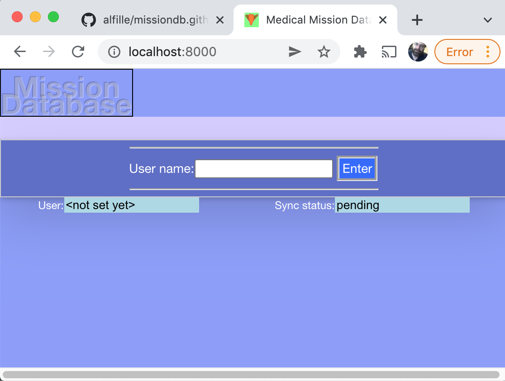
* Main Menu. 
Patient List is most common choice 
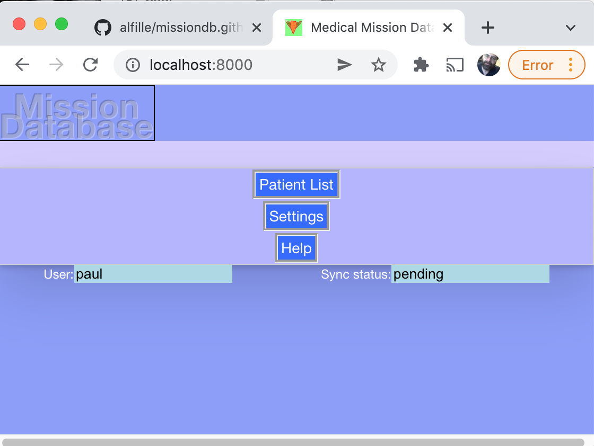
* Patient List. 
List of known patients 
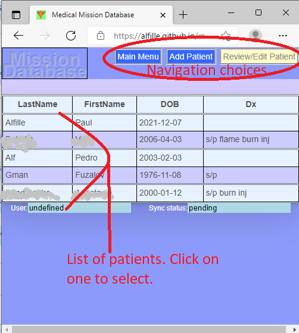
* Patient List. 
Select a patient 
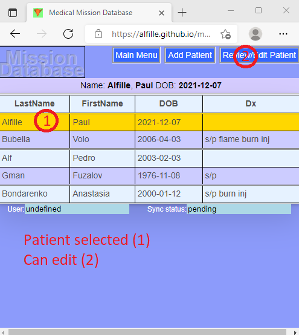
* Patient is selected. Menu for this patient 
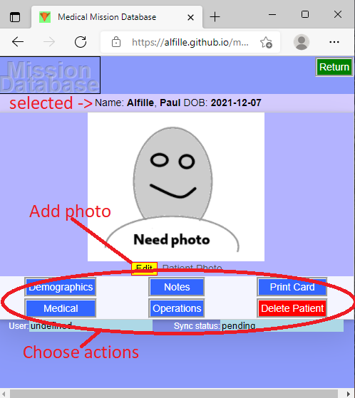
* Demographics for this patient. How to edit 
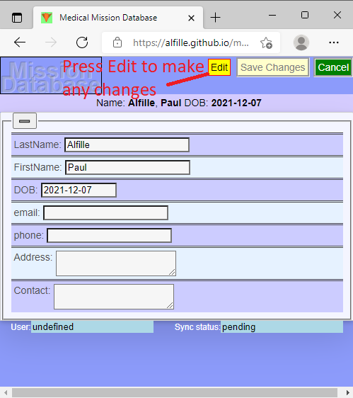
* Demographics for this patient. How to save changes 
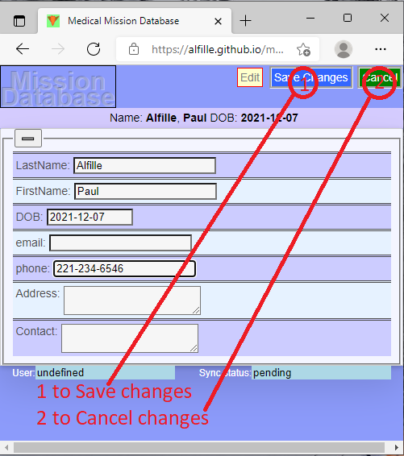
* Medical Information and Operations 
This is the main data entry screen for planning and recording operations
* Notes List
Controls
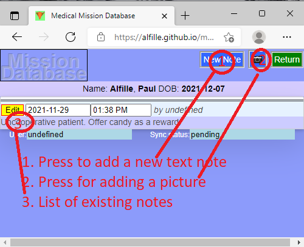
* Notes List
Start editting
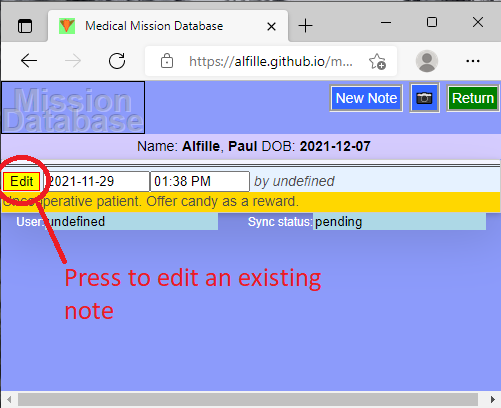
* Notes List
Text entry field
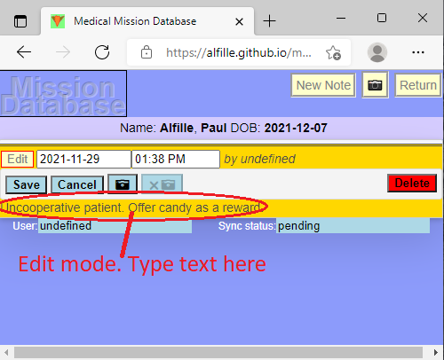
* Notes List
Edit picture
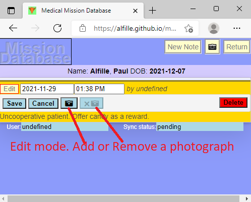
* Notes List
Save or cancel changes
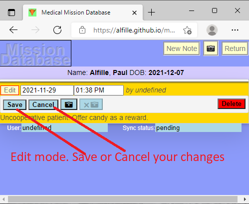
* Notes List
Edit the date and time
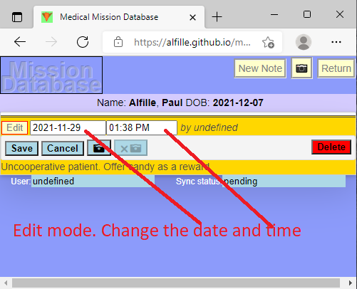
* Notes List
How to delete a note
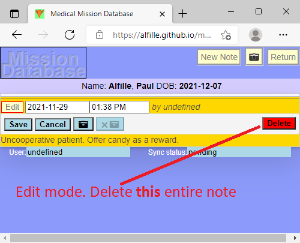
* Notes List
Add a new note
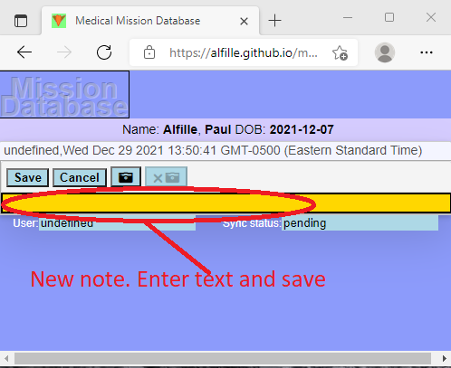
* Notes List
Add a new photo
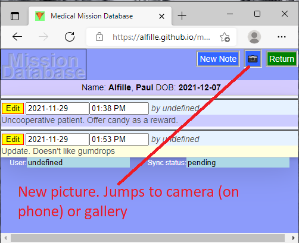


# [Database Design](/help/Schema.md)


# Installation
* Instructions from [pouchdb](https://pouchdb.com/guides/setup-couchdb.html):
```
#install couchdb
sudo apt install couchdb

#start couchdb
sudo systemctl start couchdb

#test
curl localhost:598

# add [CORS](https://developer.mozilla.org/en-US/docs/Web/HTTP/CORS)
sudo npm install -g add-cors-to-couchdb
add-cors-to-couchdb

# PouchDB
sudo npm install --save pouchdb-browser

```

  

