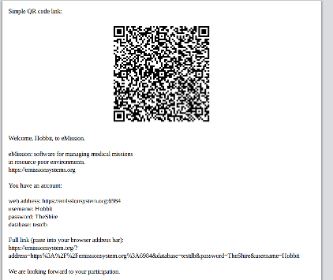

# eMission

## Briefly
eMission is a database for medical mission work. Intentionally simple. Supports your entire team using their smartphone, ipad or laptop. eMission is robust even when internet connectivity is spotty.

----------------------

## Inspiration
Dr. Gennadiy Fuzaylov, a pediatric anesthesiologist at Massachusetts General Hospital and veteran of over 60 medical missions to the Ukraine and  Columbia and found keeping track of patients, procedures and results was increasingly difficult. 

](images/dctohc.png)

He needed a way to:

* collaborate with the rest of the mission team
* keep track of patients, cases and equipment
* keep a visual record of the injuries and document followup

A spreadsheet was not adequate -- poor phone interface, poor support for images, poorly multi-user and problematic security. Hence this project was born.

------------------------------

## Scope (i.e. what eMission does)

- Patient name, problem, image and demographics
- Medical procedures with description, data, images, tailored checklists
- Providers with contact information
- Followup
- Workflow support including patient ID cards, downloadable data
- Supports phones, tablets and laptops

### Out of scope
- lab values 
- vital signs / monitoring
- drug and supply information
- But free text fields are available for extra information

----------------

## Design
* Written by Paul Alfille MD at Massachusetts General Hospital in 2021
* __Non-technical__
  * Runs entirely in a web browser (like Chrome, Safari, Edge)
  * Connects and shares data whenever the internet is available
  * Installed just be clicking a web link
  * Password protected and encrypted communication
  * Free to use and modify
  * Open Source
* __Technical__
  * Hosted on [Github](https://github.com/alfille/emission)
  * Document database: [Pouchdb](https://pouchdb.com/) for users and [Couchdb](https://couchdb.apache.org/) backend
  * Pure Javascript with no dependencies
  * Included javascript libraries are open source as well

# Start up / installation

Typically the user with get an invitaion by email. text or hard copy. It will include a web link with all the information needed to install and register your name/password included

[More information on starting up](/help/Start.md).

# Usage -- Common tasks

## Display

To make navigating easy, __eMission__ uses a consistent [screen layout](/help/GeneralLayout.md)

All choices can be made by clicking a button, or swiping (phone) and doubleclicking (laptop)

## Choosing a patient

* All the patients are listed in the [All Patients](/help/AllPateints.md) list
  * The list can be sorted by any of the headings
  * A simple swipe or double click will select that patient
  * You can also add a [new patient](/help/PatientNew.md)
+ All the patients are also included in [All Operations](/help/AllOperations.md)
  + This is list is sortable by patient, surgeon, operations, ...
* The [full text search](/help/SearchList.md) will find patients, operations and notes.
  * Use the __[&#x1F50E;&#xFE0E;]__ icon found in the top buttons
* Scan a [patient card](/help/PatientCard.md)

## Patient information

To look at or edit patient information, first select that patient (see __Choosing a patient__ above).

You will see the [Patient Menu](/help/PatientPhoto.md)

Information on the patient is split between

* [Demographics](/help/PatientDemographics.md)
  * Name, age, address, picture, ...

* [Medical](/help/PatientMedical.md)
  * Diagnosis, complaints, weight, height, medicines, allergies,...
  * for convenience, the operations can also be accessed from this page
* [Notes](/help/NoteList.md) provides a place to give longitudinal information on the patient
  * Include followup information and pictures
  * [New Notes](/help/NoteNew.md) is a convenient way to add a note
  * *__New Picture__* adds a picture to a new note
   
## Operations

* A full sortable list in [All Operations](/help/AllOperations.md)
* The [full text search](/help/SearchList.md) will find patients, operations and notes.
  * Use the __[&#x1F50E;&#xFE0E;]__ icon found in the top buttons
* For each patient, the [Operations](/help/OperationList.md) 
  * shows the scheduled and completed operations
  * allows adding and deleting operations
+ The *Surgeon*, *Procedure*, and *Equipment* have drop-down suggestions from prior choices

## Other features

As you explore, you will find more features

* __[?]__ help is available on every screen
* [Mission information](/help/MissionInfo.md) and [Notes](/help/MissionList.md) for more general conversation about the mission
* Notes can be categorized by group (anesthesia, surgery or nursing and sorted)
* Data can be []downloaded](/help/Download.md) to spreadsheet format

# Advanced information 

This section is for administrators and developers

* [Database Design](/help/Schema.md)
  * Includes the fields
  * Includes the structure used for the data entry screens
+ [Security](/help/secure.md) information
* License: [MIT](https://mit-license.org) (OpenSource)
*  Copyright 2021-2022 Paul H Alfille MD palfille@mgh.harvard.edu

  

