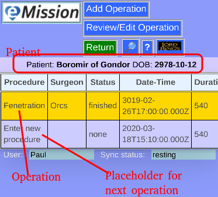

### eMission specific page help
* General [screen layout](GeneralLayout.md)
* Getting started
* Working with the application

# Operation List (per patient)

Arrive here from the *__Operations__* button on [Patient Menu](PatientPhoto.md).

*This is a list of operations for this patient. It can be sorted by each field, and includes the placeholder for the next operation.*

Using this page:

* Operations are shown in a table
* The list is sortable by each column
  * Click the heading (like __Surgeon__) to sort on that column
  * Click it again to reverse the sort order
* Touch or click any row to *select* an operation for editing (or deleting)

Selected operation:

* Operation row is highlighted in yellow
* the [*__Review/Edit Operation__*](OperationEdit.md) button is now enabled
* To use this patient you can either:
  * Click [*__Review/Edit Patient__*](PatientPhoto.md)
  * Double-click the row
  * Swipe the row left or right

