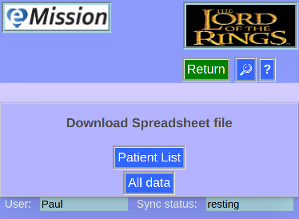

### eMission specific page help
* General [screen layout](GeneralLayout.md)
* Getting started
* Working with the application

# Download

*Export data in __CSV__ format (comma-separated values) commonly usable by spreadsheet programs*
 
Arrive here from the *__Download__* button in [Advanced Settings](Settings.md)

