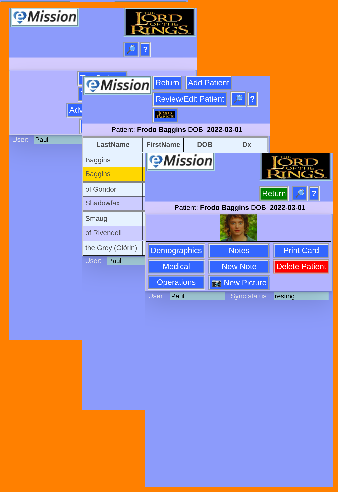
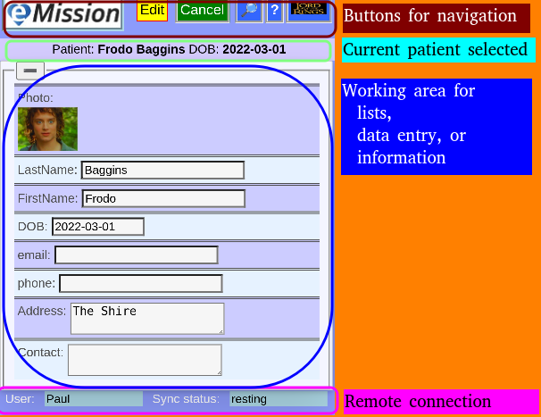

# General Layout
eMission has a number of "screens" depending on what function you are doing. Fortunately, the layout is similar on every page.

Each screen has consistent elements:

## Buttons at top
The clickable buttons include links to the Mission website and specific help pages.
## Selected Patient
* The currently selected patient is shown here. This helps orient when you are editing Demographics, Notes, Medical, or Operations.
* If no patient is selected, this area will be present but blank.
* The mission name will be shown if you are editing Mission or Mission Notes
 
## Working area
This area takes up most of the display. It will show
* Lists: [Patient](PatientList.md), [Notes](NoteList.md), [Operations](OperationList.md), [Search results](SearchList.md)
* Edit Data: [New Patient](PatientNew.md), [Demographics](PatientDemographics.md), [Medical](PatientMedical.md), [Operation](OperationEdit.md)
* Menus: [Main](MainMenu.md), [Patient](PatientPhoto.md), [Advanced settings](Setrtings.md)
## Database status
Your User Name, and the status of data synchronization to the central database.
