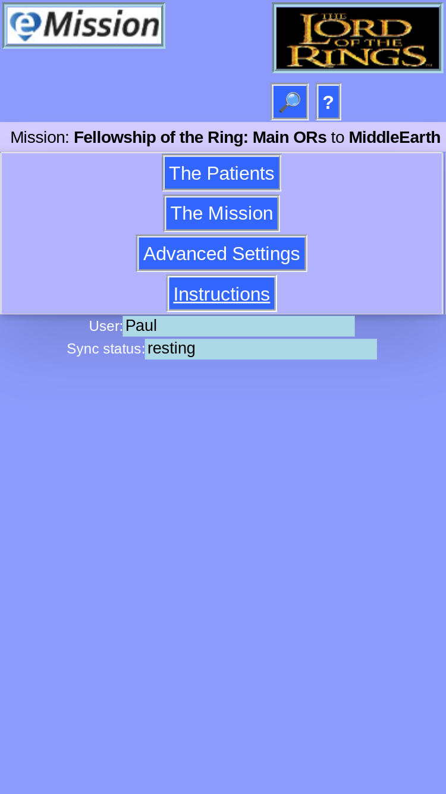

### eMission specific page help
* General [screen layout](GeneralLayout.md)
* Getting started
* Working with the application

# Main Menu

Main menu of the application

* You can always land here using the *__eMission__* button in the upper left
* Working area is a submenu of navigation choices:
  * [*__The Patients__*](PatientList.md) a sortable list of all patients
  [*__The Mission__*](MissionList.md) information on the mission -- contacts, links and notes
  * [*__Advanced Settings__*](Settings.md) Information on the database, connections, and administrative tasks
  * *__Instructions__* is a jump to the help system.
