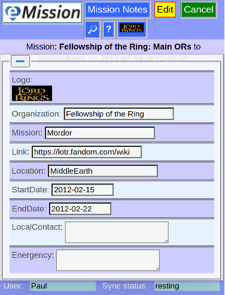
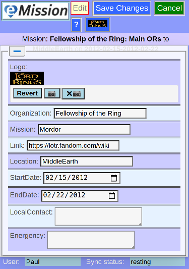

### eMission specific page help
* General [screen layout](GeneralLayout.md)
* Getting started
* Working with the application

# Mission Info

Arrive here from

* *__The Mission__* button in [Main Menu](MainMenu.md)
* *__Mission Info__* button from [Mission List](/MissionList.md)

*Add the data (including the mission name, logo, dates and information) relevant to this medical mission. Mission info is also included in [Search](SearchList.md)*

Like other data entry screen, press *__Edit__* to start editing the data.

Then *__Save Changes__* or *__Cancel__*.
