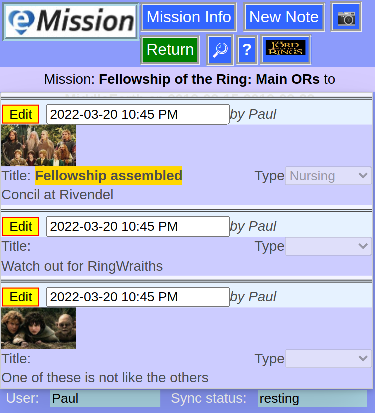

### eMission specific page help
* General [screen layout](GeneralLayout.md)
* Getting started
* Working with the application

# Mission List

Arrive here from

* *__The Mission__* button in [Main Menu](MainMenu.md)
* *__Mission List__* button from [Mission Info](/MissionInfo.md)

*The format and function of the mission notes is the same as [Patient Notes](NoteList.md) including adding photos and comments. Mission notes are also included in [Search](SearchList.md)*

The mission shown above buttons.
