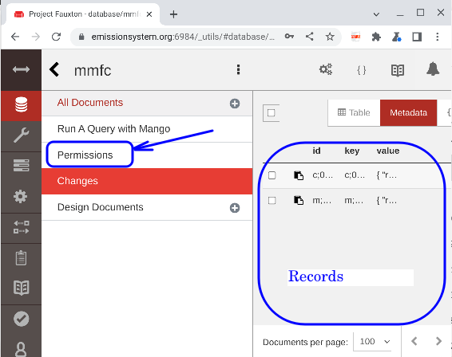

# Create a new mission database

*This is a one-time process for a database administrator*

## Prerequisites

* A couchdb server
   * We will use https://emissionsystem.org
   * Couchdb needs to be set up on the server
   * Recommended: SSL certificate and couchdb modifications to use secure connections
* Couchdb administrative access

## Administrative console (Fauxton)

Web address: 

[emissionsystem.org:6984/_utils](https://emissionsystem.org:6984/_utils)

## Database view

Selecting the database icon shows a list of databases

* There are two special databases for couchdb internal use with specialized formatting
* See [couchdb documentation](https://docs.couchdb.org/en/stable/intro/security.html) on the `_user` database design and restrictions
* All the Mission databases are also included. 
  * *Note that all the mission databases share the same user list*
  * We assign roles that are database-specific to restrict access to relevant database

## New mission database

Select the new database icon and give a unique name to the database

## Set up permissions

The new database will have few records (2 have been added here)

Select the Permissions tab to assign permissions

CouchDb has 2 levels of access:

* __Admin__ can edit the user list
* __User__ can edit data including adding and deleting

CouchDb also allows 2 ways of specifying access:

* __Users__ gives a specified list of users for each task
* __Roles__ Allows all users with the assigned role that level of access

## eMission access convention

__eMission__ uses a convention of:

* __Roles__ for access
* `all-user` and `all-admin` are added to *every database*
* `database-user` and `database-admin` (here `mmfc-user` and `mmfc-admin`) are given access *only to this database*

## Assigning roles

This is done by an administrator withing eMission in __*[New User](/help/UserNew.md)*__ or __*[Edit User](/help/UserEdit.md)

Roles can be changed and users deleted within eMission as well.

## First Use

Before users and invitations can be generated, the database must be accessed as a *administrative user* -- the same access used to access *Fauxton* to create the database.

* Go to the website (i.e. [emissionsystem.org](https://emissionsystem.org)

* Once signed in, choose *advanced settings*

* Then *Priviledged Operations*

* Finally *User Management*

