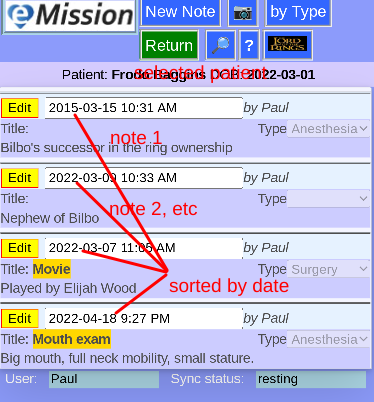
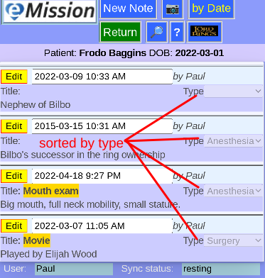
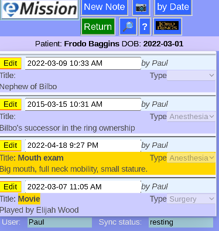
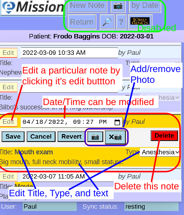

### eMission specific page help
* General [screen layout](help/GeneralLayout.md)
* Getting started
* Working with the application

# Note List

Arrive here from *__Notes__* button in [Patient Menu](help/PatientPhoto.md) or after [New Note](help/NoteNew.md)

Selected patient is shown above buttons.

## Sort order

*__by Type__* and *__by Date__* toggle how the notes are sorted

## Select note

A note can be selected by
* Clicking on the note
* Newly creating it or editing it
* Choosing from a [Search](help/SearchList.md)

## Edit a note
Click the note's edit button

* Editable parts:
  * Title (free text)
  * Text (free text, can be multi-line)
  * Type (a drop-down list)
  * Date/Time
* Controls
  * *__Save__* saves the changes and stops editing
  * *__Cancel__* reverts changes and stops editing
  * *__Revert__* reverts changes but keeps editing
  * Add or Delete a photo (uses phone camera too)
  * *__Delete__* removes this note (asks for confirmation)
* Note that navigation is disabled until the note is *__Save__* or *__Cancel__* so that changes are not lost
* The *__eMission__* top left will abort changes and go directly to the [MainMenu](help/MainMenu.md)
 
