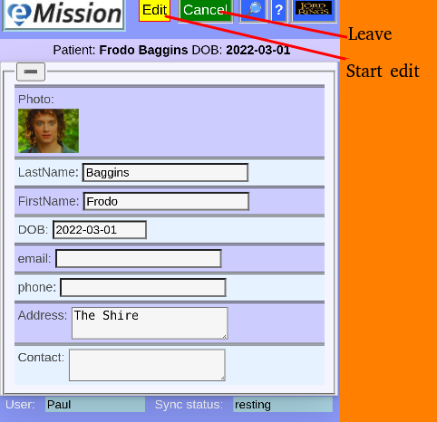
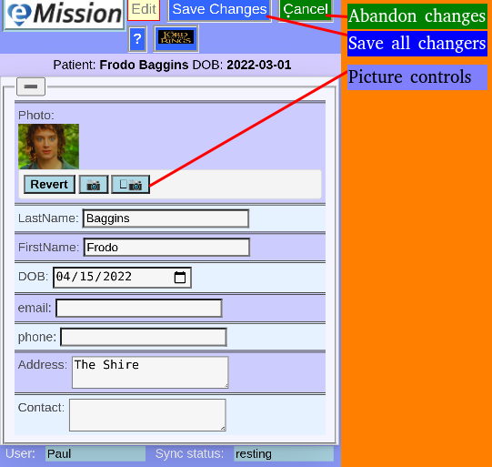

# Demographics

These are  basic information about the patient including how to contact.

* initially in view mode
* includes the ability to add a patient picture that will be shown on the printed card
* to edit, Press edit button

* the picture can be added or changed using the standard photo controls
* Name and DOB (Date Of Birth) are originally set when the patient is first created, but can be modified here. 