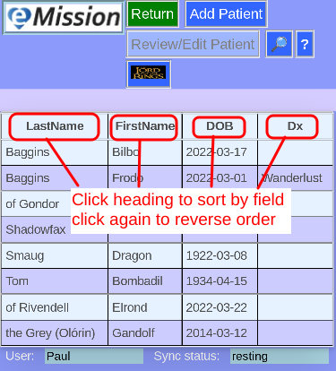
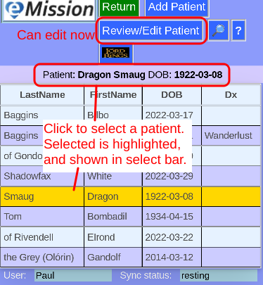

### eMission specific page help
* General [screen layout](GeneralLayout.md)
* Getting started
* Working with the application

# Patient List

Arrive here from *__The Patients__* button in [Main Menu](MainMenu.md) 

*This is the most useful general screen. You can sort through your patients, select a patient, or add a new patient.*

The list is sortable by each column.

Click [*__Add Patient__*](PatientNew.md) to add a new patient.

Touch or click any row to select the patient.

Selected patient is shown above buttons.

To use this patient you can either:
* Click [*__Review/Edit Patient__*](PatientPhoto.md)
* Double-click the row
* Swipe the row left or right

