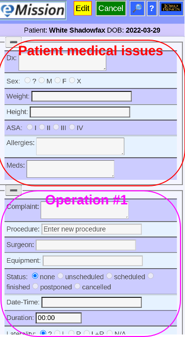
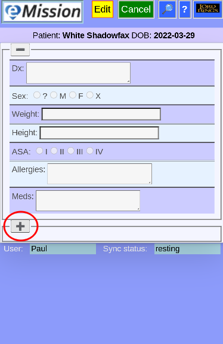

### eMission specific page help
* General [screen layout](help/GeneralLayout.md)
* Getting started
* Working with the application

# Medical Status and Operations

ccv

Arrive here from *__Medical__* button in [Patient Menu](help/PatientPhoto.md)
* Selected patient is shown below buttons
* Combines information from at least 2 records:
  * Patient's medical condition
  * Operations
  * At least one blank operation will be at the end of the list
* Make changes after clicking *__Edit__* 
+ Click *__Save Changes__* or *__Cancel__* after editing 

If the Screen seems too cluttered, it is possible to hide some of the data (Either medical, or any operation) by toggling the *__+__* / *__-__* buttons.

