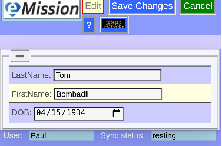

### eMission specific page help
* General [screen layout](help/GeneralLayout.md)
* Getting started
* Working with the application

# Add new patient

Arrive here from *__Add Patient__* button in [PatientList](help/PatientList.md)
* Starts automatically with *__Edit__* clicked
* No patient selected (of course)
* All 3 elements required
  * Last Name
  * First Name
  * Date Of Birth
+ Patient ID (A unique internal identifier) created from these 3 elements
+ Click *__Save Changes__* to actually create this patient or *__Cancel__*
+ These entries can be modified in [Demographics](help/PatientDemographics.md)
+ Next screen is [Patient Menu](help/PatientPhoto.md) with choices for managing this new patient's information

