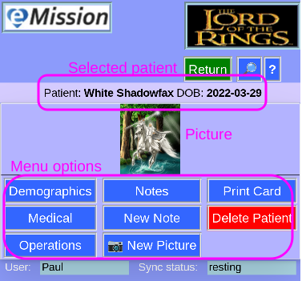

### eMission specific page help
* General [screen layout](GeneralLayout.md)
* Getting started
* Working with the application

# Patient Card (printed)

Choose from the available options for the selected patient

Reach this screen from the [Patient List](AllPatients.md) screen

What the menu choices do:

* [*__Demographics__*](PatientDemographics.md) photo, name and other non-medical info.
* [*__Medical__*](PatientMedical.md) conveniently combines patient medical condition and operations
* [*__Operations__*](OperationList.md) a sortable list of operations on this patient (planned and completed)
* [*__Notes__*](NoteList.md) a chronological list of notes and photos for this patient
* [*__New Note__*](NoteNew.md) quick way to add a note
* [*__New Picture__*](PhotoNew.md) quick way to add a photo to notes
* [*__Print Card__*](PrintCard.md) print an id card for the patient
* [*__Delete Patient__*](DeletePatient.md) Delete this patient (you will be asked to confirm)
