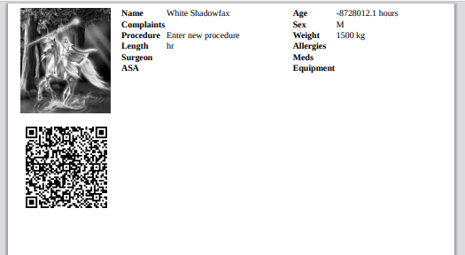

### eMission specific page help
* General [screen layout](GeneralLayout.md)
* Getting started
* Working with the application

# Patient Card (printed)

*Print a card for managing the patient*

Reach this screen from the [Patient Menu](PatientPhoto.md) screen

Card elements:

* Photograph of the patient
* QR code that encodes a direct web link to the patient
* Patient demographics and condition
* Planned operation