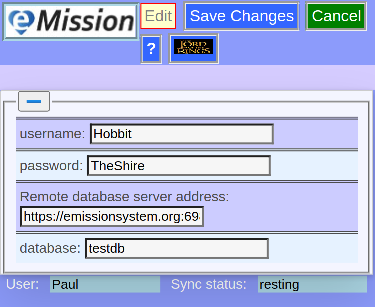

# Starting eMission

## Getting an invitation

You will get the address, user name, database name and password from your mission leader.

Possible ways are:

* An letter like this: 
* A text or email
* If you don't get a link, visit https://emissionsystem.org and you will get a chance to enter the information directly
* 

## Get the medical records

This is automatic (but may take a little while)

## What next?

## Coming back

A local copy of the program and data stays in your browser. You can get back to it by:

* Keep the browser tab open
* Reopen the tab in any of these ways:
  * Add to favorites
  * Look in history 
  * Click on the original invitation again

## Clear everything

To clear the local data from your browser (for security, it's not required otherwise)
From [Main Menu](/help/MainMenu.md) choose [Advanced Settings](/help/Settings.md)
then *__Clear local data__*
