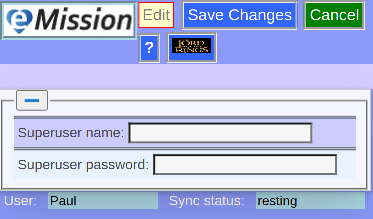

### eMission specific page help
* General [screen layout](GeneralLayout.md)
* Getting started
* Working with the application

# Super User Access

*Required for database administrator access for functions like user management and native database console (Fauxton).*

