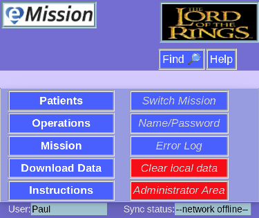
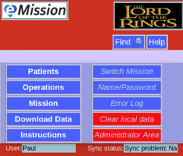

# Background Color

Under normal conditions, eMission is a lovely blue:

Except the advanced administrative area whch is green to distinguish it.

If the network is disconnected, however (perhaps poor wifi coverage) the background changes to violet:

And finally, if your credentials are incorrect (or the database name or web address are wrong) this is signaled by red:

More detail can be seen in the [Error Log](ErrorLog.html)