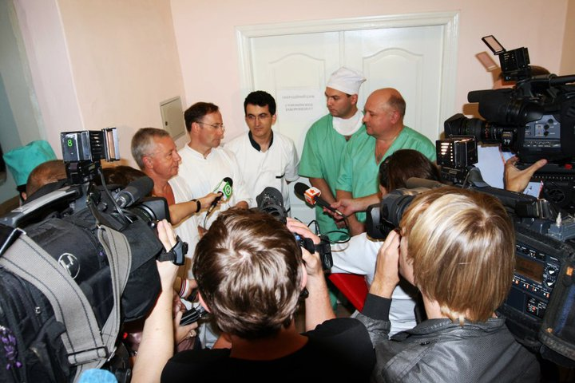

# Your Own Server

### How to set up your own infrastructure

You may already have an IT infrastructure in place with servers, domain, and some expertise.

While you can duplicate our setup, the following components are what's really needed:

* Public web server
  * This will server the code, images and documentation
  * SSL encryption is recommended
  * No CGI or modules are needed, just straight html
  * Duplicating the [emission github website](https://github.com/alfille/emission) as the server document source should be sufficient
* [mdbook](https://rust-lang.github.io/mdBook/) the document system from the Rust community needs to be run once in server root dir to build html from markdown:
`mdbook build`
* [CouchDB](https://docs.couchdb.org/en/stable/install/index.html) needs to be set up
  * Excellent documentation, set up as non-clustered
  * Suggest SSL (port 6984) and block port 5984
  * Couchdb should be in the same domain as the web address, though of course it can be a different machine
  
### First time

* Set up database (use Fauxton couchdb console)
* Add to database list using an available python script
* Use eMission software (via web browser)
  * Set up yourself as a user
  * Add mission information
* That's it

### Operating system

While the development and deployment has been on linux, all the software is platform agnostic.
