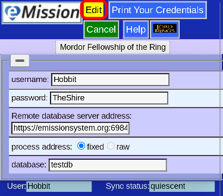

# Manually enter credentials

Often your credentials (name, password, database and server) are entered automatically from the QR code or link your Mission Leader gave you.

If you need to manually enter or correct them, choose **Name/Password** from the [Main Menu](MainMenu.html)

You can edit your information:

and press **Save Changes**
