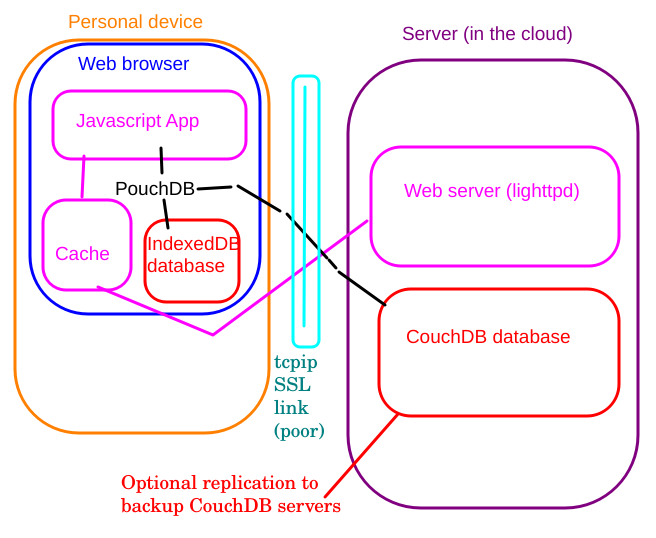

# Overall architecture

# Overview of system design

## Personal

### Device

* Browser
* Smartphone / Tablet
* Laptop / Desktop / Chromebook
* *Intermittent network access*

### Browser

* Runs Javascript App (ES11+)
* Service Worker for caching App
* PouchDB (javascript) is in-app database engine
* Browser database (IndexedDB)
* Replicates with Server (CouchDB)

## Central

### Server functions

* Either dedicated or virtual
  * Needs DNS address
  * Needs storage for database and content
* Web server
  * Deliver App and HTML for caching
  * Hold non-cached help documents
  * Preferably SSL secure
  * Implemented using *lighttpd* although basically any static content web server would work (e.g. nginxm caddy, ...)
* CouchDB server
  * Runs needs storage for database
  * Has own *Fauxton* web console 