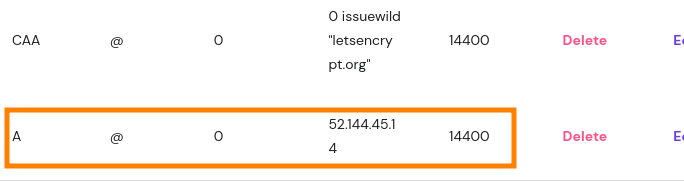

# Domain Name

Your *Domain Name* is a globally unique address to your site. An example it [eMissionSystem = emissionsystem.org](emissionsystem.org).

* The domain comes from top level registrars. Obviously it is best if it matches your organization, and has a recognizable top level like *org* or *net*. There is typically a fee for the name ($15-$30 /yr).

A number of vendors (icluding quite possibly your VPS provider) will help you find, purchase and manage your domain. We use [Hostinger](https://www.hostinger.com/domain-name-search)

Although other services will likely be offered (email addresses, web hosting) the main requirement is to edit your DNS record:

Specifically, find the "A" record and place your VPS' IP address there. That way, all queries to that address will be forwarded to your VPS server's network port.
