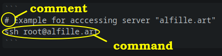

# General design

## Programs
|Function |Program|Packaging |
|---|---|---|
|operating system|Debian 12|From [VPS provider](provisioning.html)|
|console access|ssh|Built into operating system|
|  |  |user: root|
|  |  |password:[__*server_password*__](essential_info.html)|
|Firewall|ufw|apt|
|Packaging|snap|apt|
|Documentation|mdbook|snap|
|Application|eMission|git|
|Web server|caddy|apt|
|Database|couchdb|snap|

## Arrangement


## Access
Initial setup will be using a CLI (command line interface)

```
# Example for acccessing server "alfille.art"
ssh root@alfille.art
```



Here is an example of a command -- in this case the actual command to access the server.

* alfille.art is the __*domain_name*__
* you will be prompted for the __*server_password*__
* comments start with "#" and are only present to make the instructions clearer * you don't need to include comments

All other examples will be __*on*__ the server, after logging in.

